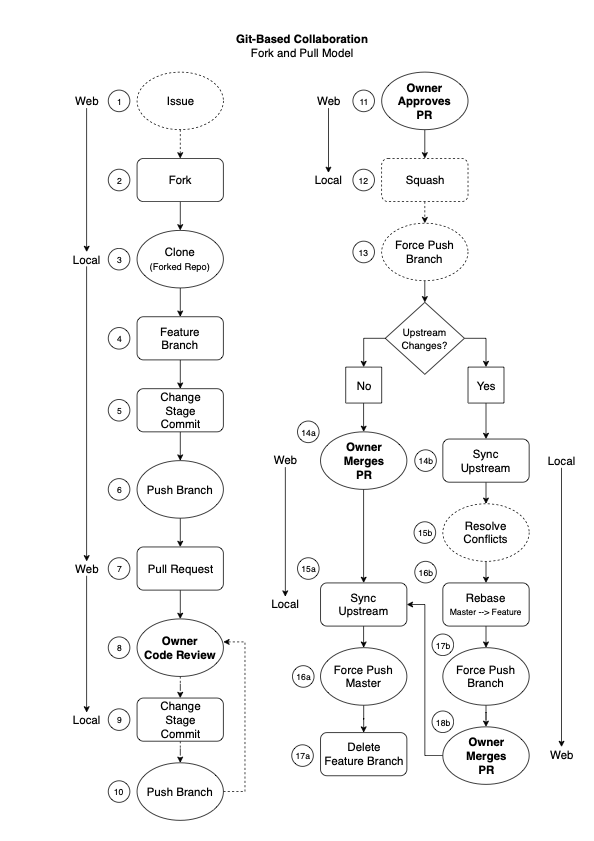

# Contributing to Event Driven .NET

_Contributions from the community are welcome!_

## A Few Simple Rules

- Before submitting a pull request, please open an issue in the appropriate repository. If you are unsure or have a general question, you can open an issue in the Home repository.
- Keep your pull request focused on a *single issue*. If necessary you can open multiple pull requests, each mapped to a separate issue.
- Try to match the style and conventions of the existing code. By default Event Driven .NET relies on JetBrains [Rider / ReSharper C# coding standards](https://www.jetbrains.com/help/rider/Settings_Code_Style_CSHARP.html).

## Pull Request Process

> For an overview of the pull request process please refer to this [Contributing Tutorial](https://github.com/tonysneed/Tutorial.Contributing/blob/master/README.md).

<p align="center">
  
</p>

### Fork, Branch, Test

1. Before creating a pull request, first create an [issue](https://guides.github.com/features/issues/) to discuss the contribution you would like to make.
2. [Fork](https://guides.github.com/activities/forking/) this repository.
3. [Clone](https://help.github.com/en/github/creating-cloning-and-archiving-repositories/cloning-a-repository) your **fork** (not the original repository).
4. Create a [branch](https://www.atlassian.com/git/tutorials/using-branches).
   - [Optional] Prefix your branch name with `@fix/` or `@feature/`
    ```
    git checkout master
    git checkout -b @fix/my-bug-fix
    ```
5. Start by writing a _failing_ unit test.
   - This helps document expected behavior and can protect against changes which cause undesired results.
6. Implement your proposed code changes.
7. Build the solution.
   ```
   dotnet build
   ```
8.  Run unit tests.
   - If you wrote a failing test, ensure that the test now passes.
    ```
    dotnet test
    ```

### Stage, Commit, Push

11. [Stage](https://www.atlassian.com/git/tutorials/saving-changes) and [commit](https://www.atlassian.com/git/tutorials/saving-changes/git-commit) your changes.
    - Add as many commits as you like. (Later you will squash these into a single commit.)
    ```
    git add .
    git commit -m "Commit message"
    ```
12. Push your branch.
    ```
    git push -u origin @fix/my-bug-fix
    ```

### Create Pull Request

13. Create a [pull request](https://help.github.com/en/github/collaborating-with-issues-and-pull-requests/about-pull-requests).
    - Include a general description of your proposed changes.
    - Put `Closes #XXXX` in your comment. This will auto-close the issue that your PR fixes.
14. After the repo owner reviews your PR, implement any requested changes.
    ```
    git add .
    git commit -m "Commit message"
    git push
    ```
15. If your PR is open for some time, you will need to [sync your fork](https://help.github.com/en/github/collaborating-with-issues-and-pull-requests/syncing-a-fork) with the original repository.
    - Add an _upstream_ that points to the original repository.
    ```
    git remote add upstream https://github.com/event-driven-dotnet/SomeRepository.git
    ```
    - Pull commits from `upstream master` and rebase your new commits on top.
        > **Note**: Make sure you are on the branch from which you are submitting your PR. For example: `git checkout @fix/my-bug-fix`
    ```
    git pull --rebase upstream master
    ```
    - Resolve conflicts if necessary. Using Visual Studio Code, you can select `Accept Current Change`, `Accept Incoming Change`, `Accept Incoming Change`, `Accept Both Changes`, or `Compare Changes`.
    - Once you resolve conflicts in a file, make sure to _save_ the file. Then _stage_ changes and continue rebase.
    ```
    git add .
    git rebase --continue
    ```
    - Because `rebase` changes the commit id, you need to push changes to the feature branch in your forked repo using the `--force` flag.
    ```
    git push --force
    ```

### Squash Commits

16. After the reviewer accepts your PR, squash your commits into a one or more commits.
    - Determine the *number of commits* you need to squash by looking at the git log. Type `q` to exit the log.
    ```
    git lg
    ```
    - Use interactive rebase to squash all your commits into one commit, specifying after `HEAD~` the number of commits you wish to squash. (Replace `#` below with the number of commits you wish to squash.) During this process you will set the commit message.
    ```
    git rebase -i HEAD~#
    ```
    - Follow the remaining steps in these [instructions](http://gitready.com/advanced/2009/02/10/squashing-commits-with-rebase.html).
17. Push your squashed commit.
    - Because rebase changes commits, you will need to add the `--force` flag when pushing your commits.
    ```
    git push --force
    ```
18. Once you your PR has been accepted and merged, you can _pull_ `master` and _delete_ your local branch.
    ```
    git checkout master
    git pull
    git branch -d @fix/my-bug-fix
    ```